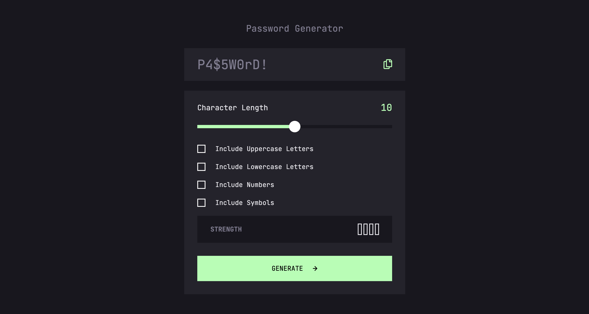

Password Generator is a dynamic web application built with React, designed to generate secure, random passwords based on user preferences. It features customizable options for password length and character types (uppercase, lowercase, numbers, symbols), a responsive design optimized for mobile and desktop, and a clean, interactive interface.

